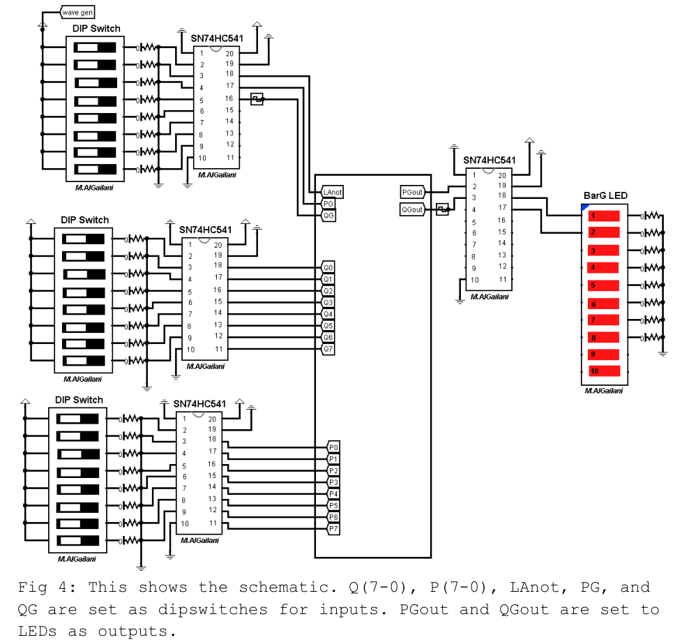
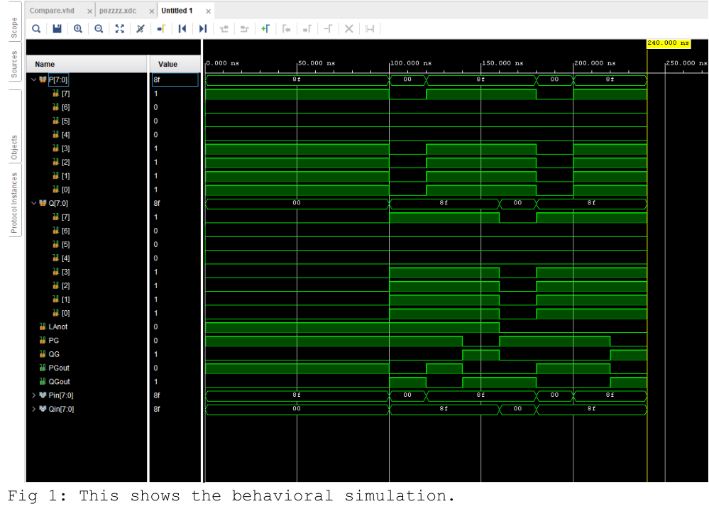
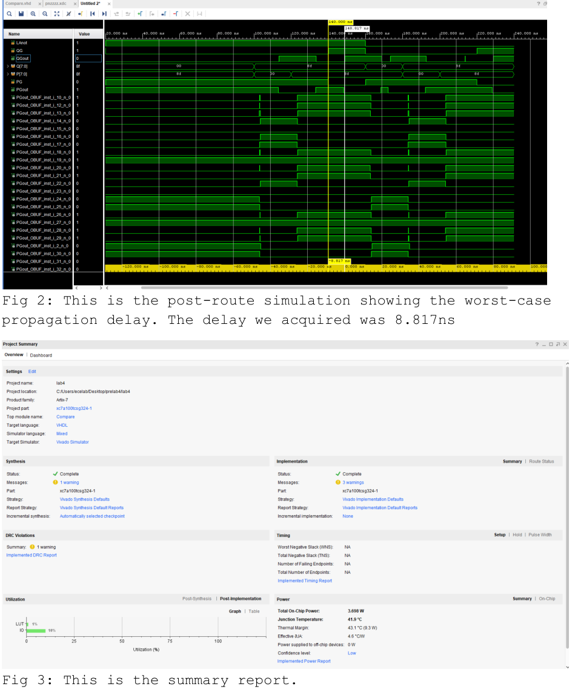
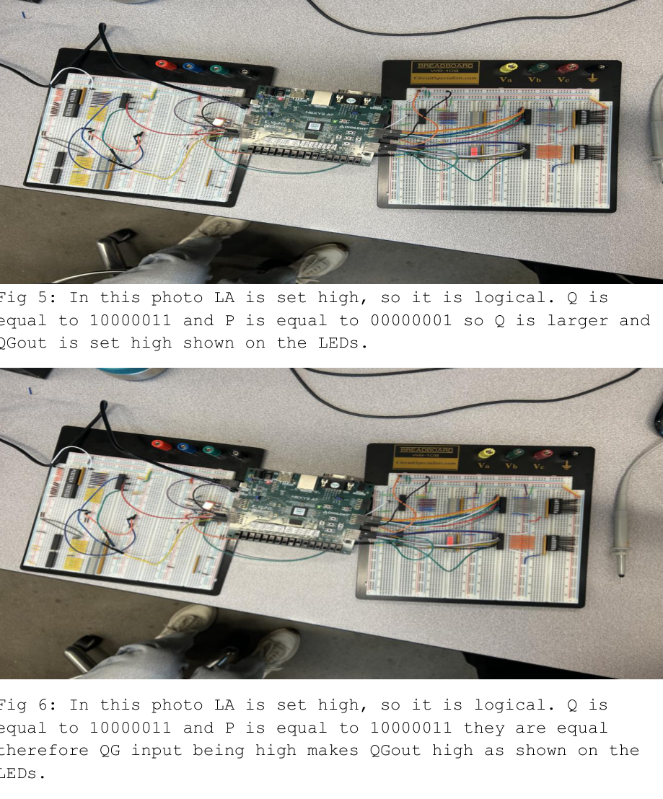
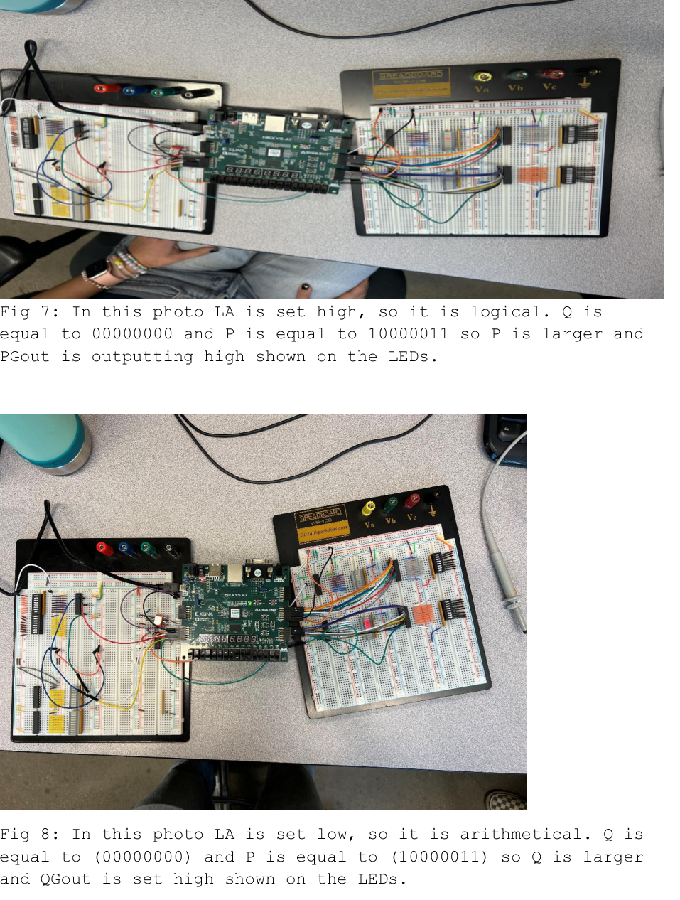
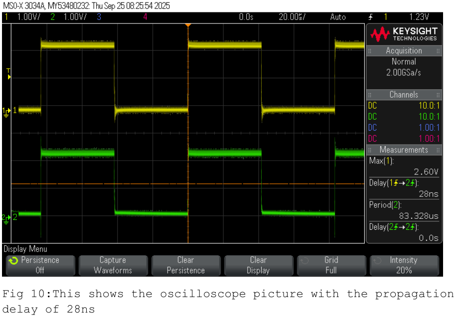

# 8‑bit Logic/Arithmetic Comparator (SN74AS885-style) on Nexys A7

This lab was about building a *real comparator chip* in VHDL — specifically, the **SN74AS885** style comparator (minus the PLE signal). Two modes matter:

- **Logical mode (unsigned):** compare `P` and `Q` like normal 0…255 numbers  
- **Arithmetic mode (signed):** compare `P` and `Q` as **two’s‑complement signed** values

Inputs come from switches (Pmod/DIP-style wiring), and outputs light LEDs. We verified the design in **behavioral simulation**, confirmed timing with **post-route simulation**, then implemented on the FPGA and measured the longest propagation delay on real hardware.

**Post-route worst-case delay:** **8.817 ns**  
**Measured on scope:** **~28 ns** (includes real I/O + probing effects)

---

## What’s in this repo

- VHDL implementation of the SN74AS885-like comparator (no PLE)
- Tcl force script used for simulation test cases
- XDC constraints mapping `P`, `Q`, `LAnot`, `PG`, `QG`, and outputs to Pmod headers
- Screenshots (schematic, sim, implementation output, oscilloscope capture, hardware photos)
- Full report PDF under `report/`

---

---

## How the comparator behaves

### Outputs
- **PGout** goes high when **P > Q**
- **QGout** goes high when **Q > P**
- When **P == Q**, outputs fall back to the “cascade inputs”:
  - `PGout <= PG`
  - `QGout <= QG`

That’s the same “compare + cascade” idea the SN74AS885 uses.

### Mode select
- `LAnot = 1` → **logical (unsigned) compare**
- `LAnot = 0` → **arithmetic (signed) compare** using two’s complement

---

## Schematic + screenshots

### Schematic


### Behavioral simulation (sanity check)


### Post-route timing + implementation summary


### Hardware setup photos (example input cases)



### Oscilloscope capture (measured propagation delay)


---

## Code snippets (the important parts)

### Signed vs unsigned handling (VHDL)

```vhdl
library IEEE;
use IEEE.STD_LOGIC_1164.ALL;
use IEEE.NUMERIC_STD.ALL;

signal Pin : signed(7 downto 0);
signal Qin : signed(7 downto 0);

Pin <= signed(P);
Qin <= signed(Q);

process(LAnot, P, Q, Pin, Qin, PG, QG)
begin
  if (LAnot = '1') then
    -- logical / unsigned compare
    if (P > Q) then
      PGout <= '1'; QGout <= '0';
    elsif (P < Q) then
      PGout <= '0'; QGout <= '1';
    else
      PGout <= PG;  QGout <= QG;
    end if;
  else
    -- arithmetic / signed compare (two's complement)
    if (Pin > Qin) then
      PGout <= '1'; QGout <= '0';
    elsif (Pin < Qin) then
      PGout <= '0'; QGout <= '1';
    else
      PGout <= PG;  QGout <= QG;
    end if;
  end if;
end process;
```

### Tcl forcing (simulation test pattern)

```tcl
restart
add_force LAnot {1 0ns}
add_force P {10001111 0ns}
add_force Q {00000000 0ns}
add_force PG {1 0ns}
add_force QG {0 0ns}
run 100ns
```

---

## Pin mapping (from the report XDC)

### P inputs (P[0..7]) → Pmod **JA**
- JA[1], JA[2], JA[3], JA[4], JA[7], JA[8], JA[9], JA[10]

### Q inputs (Q[0..7]) → Pmod **JB**
- JB[1], JB[2], JB[3], JB[4], JB[7], JB[8], JB[9], JB[10]

### Mode + cascade inputs → Pmod **JC**
- `LAnot` → JC[1]
- `PG`    → JC[2]
- `QG`    → JC[3]

### Outputs → Pmod **JC**
- `PGout` → JC[4]
- `QGout` → JC[7]

---

## Running it (Vivado)

1. Create a Vivado project targeting **Nexys A7**.
2. Add `src/SN74AS885.vhd`
3. Add `constraints/lab4.xdc`
4. Run:
   - **Behavioral simulation** (then `source sim/lab4_forces.tcl`)
   - **Implementation**
   - **Post-implementation timing simulation**
5. Program the FPGA and validate outputs by flipping inputs and checking LEDs.

---

## Report

Full write-up: `report/ECE_4525 Lab 4.pdf`
